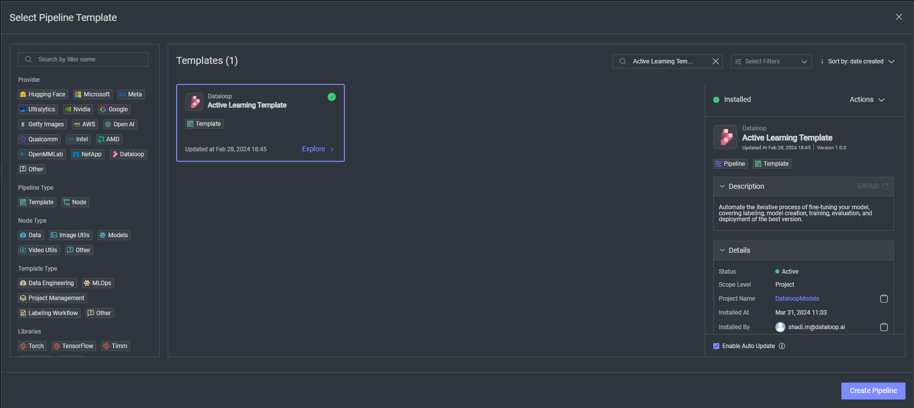

# *Active Learning* Template

### Introduction:

Explain about the template flow here.

### installation:

In order to use the template, you need to follow these steps:

* Open the pipelines page and select Create Pipeline. 
* Select Use a Template from the dropdown list.

* In the search bar, type the -pipeline name-, select the template and click install.
* Once the template is installed, click on *Create Pipeline*.

### Usage: 
Once the installation is complete, Follow the next steps to use the pipeline:
- Steps needed like inputs / components to update etc.-

## Contributions, Bugs and Issues - How to Contribute

We welcome anyone to help us improve this app.  
[Here's](CONTRIBUTING.md) a detailed instructions to help you open a bug or ask for a feature request.