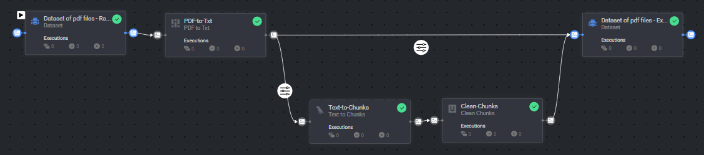
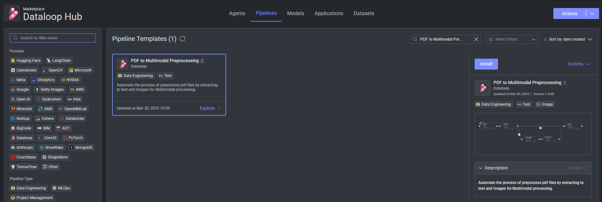

# PDF to CLIP Preprocessing Template

### Introduction:

This template creates the process of converting pdf items to text and image files. 
Each file is generated for a specific chunk of data. 
The text files undergo preprocessing using cleaning functions provided by the `UnstructuredIO` library.

All extracted items are transferred to the target dataset, where CLIP can be applied to extract embeddings on both the text and image files.

### Installation:

There are two options for installing and using the template:

1. Pipelines:

* Open the pipelines page and select Create Pipeline.
* Select Use a Template from the dropdown list.

2. Marketplace

* In the search bar, type `PDF to Clip Preprocessing Template`, select the template and click install.
* Once the template is installed, click on *Create Pipeline*.

