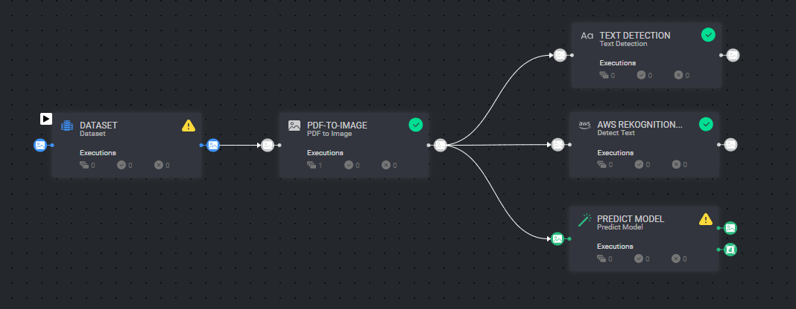
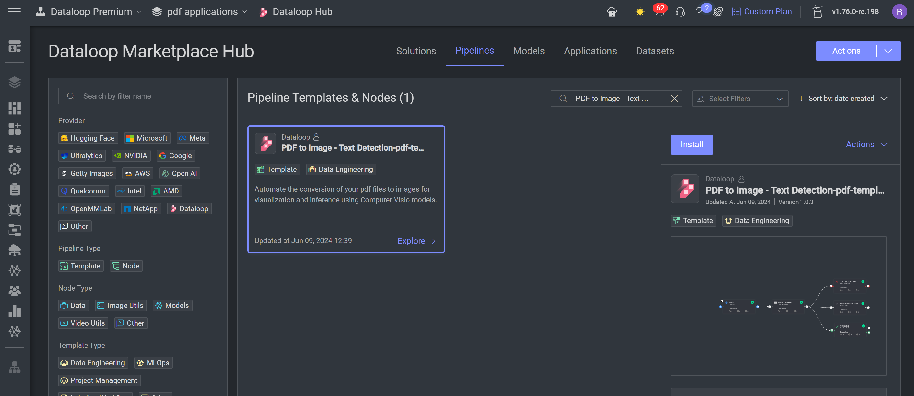

# *PDF to Image - Text Detection Pipeline Template*

### Introduction:

This template application creates a pipeline flows that converts pdfs to images, where each page is a single image.
The generated images serve as input to computer vision models:  `AWS Rekognition - Detect Text`,
`Google vision - Text Detection` and any other predictive model from Dataloop's Marketplace with images as an input.

### Installation:

There are two options for installing and using the template:

1. Pipelines:

* Open the pipelines page and select Create Pipeline.
* Select Use a Template from the dropdown list.

1. Pipelines:

* In the search bar, type `PDF to Image - Text Detection`, select the template and click install.
* Once the template is installed, click on *Create Pipeline*.

[//]: # (### Usage:)

[//]: # ()

[//]: # (For the complete documentation of the Active learning pipeline, please refer to)

[//]: # (the [Active Learning Pipeline Documentation]&#40;https://dataloop.ai/docs/active-learning-pipeline&#41;)

## Contributions, Bugs and Issues - How to Contribute

We welcome anyone to help us improve this app.  
[Here's](../../CONTRIBUTING.md) a detailed instructions to help you open a bug or ask for a feature request.