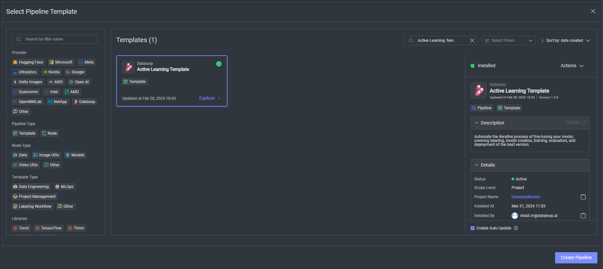

# *PDF to Images Pipeline* Template

### Introduction:

This template create the process of converting pdf items to images, image for each pdf page. The crafted image is than 
can be served as an input to computer vision models such as `AWS Rekognition - Detect Text`, `Goggle vision - Text Detection`
or any other predictive model with images as an input. 

### Installation:

In order to use the template, you need to follow these steps:

* Open the pipelines page and select Create Pipeline.
* Select Use a Template from the dropdown list.

* In the search bar, type `PDF to Images Pipeline Template`, select the template and click install.
* Once the template is installed, click on *Create Pipeline*.

[//]: # ()

[//]: # (### Usage:)

[//]: # ()
[//]: # (For the complete documentation of the Active learning pipeline, please refer to)

[//]: # (the [Active Learning Pipeline Documentation]&#40;https://dataloop.ai/docs/active-learning-pipeline&#41;)

## Contributions, Bugs and Issues - How to Contribute

We welcome anyone to help us improve this app.  
[Here's](CONTRIBUTING.md) a detailed instructions to help you open a bug or ask for a feature request.