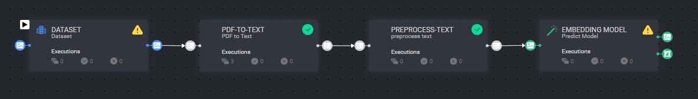
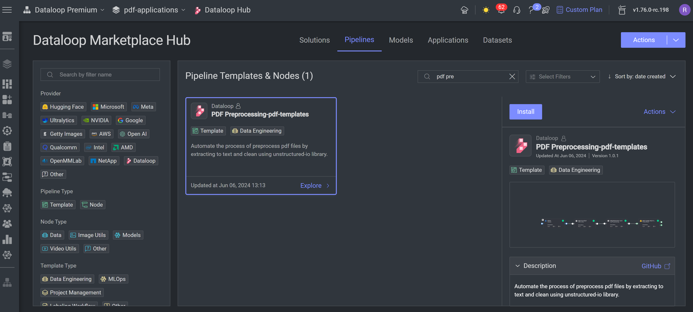

# *PDF Preprocessing* Template

### Introduction:

This template create the process of converting pdf items to text files. Each file is generated for a specific chunk of
data. The text files undergo preprocessing using cleaning functions provided by the `UnstructedIO` library.

### Installation:
There are two options for installing and using the template:

1. Pipelines:

* Open the pipelines page and select Create Pipeline.
* Select Use a Template from the dropdown list.

2. Marketplace

* In the search bar, type `PDF Preprocessing Template`, select the template and click install.
* Once the template is installed, click on *Create Pipeline*.

[//]: # (### Usage:)

[//]: # ()

[//]: # (For the complete documentation of the Active learning pipeline, please refer to)

[//]: # (the [Active Learning Pipeline Documentation]&#40;https://dataloop.ai/docs/active-learning-pipeline&#41;)

## Contributions, Bugs and Issues - How to Contribute

We welcome anyone to help us improve this app.  
[Here's](..%2F..%2FCONTRIBUTING.md) a detailed instructions to help you open a bug or ask for a feature request.