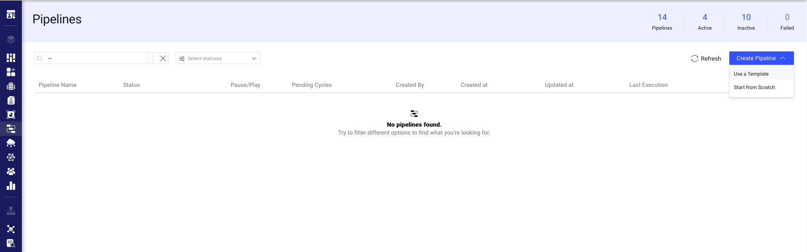

# *PPT Sanitization Detection Pipeline Template*

### Introduction:

This template application creates a pipeline flow that takes .pptx files as inputs and passes it through two nodes: one 
performs NER and replaces named entities such as locations, people, organization, etc. by tags; and a second node 
removes visual identifiers from the presentation. The final result is a ppt file with a neutral white background with 
black text 

### Installation:

There are two options for installing and using the template:

1. Pipelines:

* Open the pipelines page and select Create Pipeline.
* Select Use a Template from the dropdown list.
* 

2. Marketplace:

* In the search bar, type `PPT Sanitization`, select the template and click install.
* Once the template is installed, click on *Create Pipeline*.

[//]: # (### Usage:)

[//]: # ()

[//]: # (For the complete documentation of the Active learning pipeline, please refer to)

[//]: # (the [Active Learning Pipeline Documentation]&#40;https://dataloop.ai/docs/active-learning-pipeline&#41;)

## Contributions, Bugs and Issues - How to Contribute

We welcome anyone to help us improve this app.  
[Here's](CONTRIBUTING.md) a detailed instructions to help you open a bug or ask for a feature request.