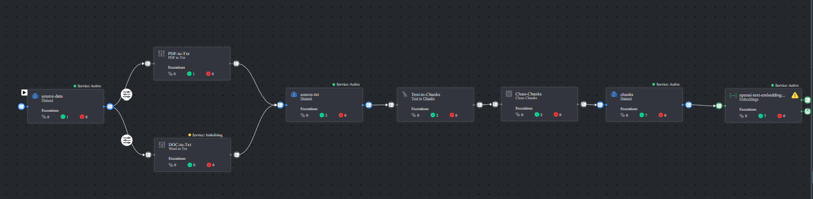
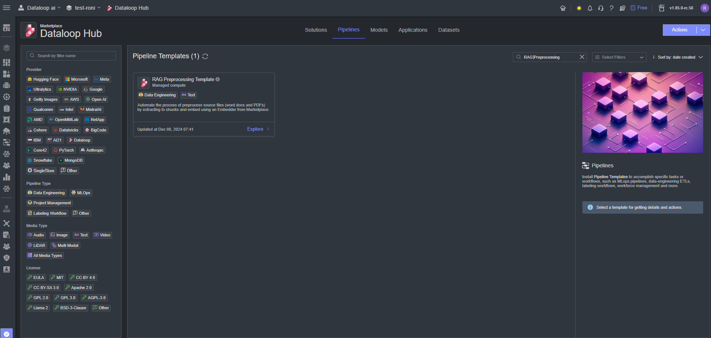

# *RAG Preprocessing Pipeline Template*

### Introduction:

This pipeline processes a source dataset containing Word and PDF documents by transforming them into chunked `.txt` files. 
The text files are then cleaned using `Unstructured.io` functions. Finally, the chunks are embedded, resulting in a feature 
set of your source data, ready for use in the `RAG Template`.

#### Overview

The pipeline consists of several interconnected modules, each responsible for a specific preprocessing task. 
These modules include:

* **PDF to txt**: Converts PDF documents into plain text format to make the content processable.  
* **Word to txt**: Transforms Word documents (`.doc`, `.docx`) into plain text files for uniformity.  
* **Txt to Chunks**: Splits the plain text into smaller, manageable chunks for efficient processing and context generation.  
* **Clean Chunks**: Uses `Unstructured.io` functions to clean and standardize the text chunks, removing unnecessary or noisy elements.
* **Embedder**: Encodes the chunks into vector representations, creating a feature set ready for downstream tasks, such as retrieval or analysis in the `RAG Template`.

Create 3 Datasets:
* **Source dataset** - Can include .pdf, .doc, .docx files
* **Txt Source** - will include all the files in txt format
* **Chunks Dataset** - this wil be the embedded dataset, and the input for the RAG template

### Installation:

There are two options for installing and using the template:

1. Pipelines:

* Open the pipelines page and select *Create Pipeline*.
* Select *Use a Template* from the dropdown list.

2. Marketplace:

* In the search bar, type `RAG Preprocessing`, select the template and click install.
* Once the template is installed, click on *Create Pipeline*.

[//]: # (### Usage:)

[//]: # ()

[//]: # (For the complete documentation of the Active learning pipeline, please refer to)

[//]: # (the [Active Learning Pipeline Documentation]&#40;https://dataloop.ai/docs/active-learning-pipeline&#41;)

