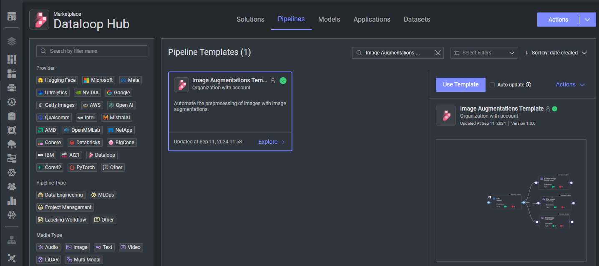

# *Image Augmentations Pipeline Template*

### Introduction:

This template application creates a pipeline flows that adds images with different augmentations and saves them to the dataset.

### Installation:

There are two options for installing and using the template:

1. Pipelines:

* Open the pipelines page and select Create Pipeline.
* Select Use a Template from the dropdown list.

1. Pipelines:

* In the search bar, type `Image Augmentation Template`, select the template and click install.
* Once the template is installed, click on *Create Pipeline*.

[//]: # (### Usage:)

[//]: # ()

[//]: # (For the complete documentation of the Active learning pipeline, please refer to)

[//]: # (the [Active Learning Pipeline Documentation]&#40;https://dataloop.ai/docs/active-learning-pipeline&#41;)

