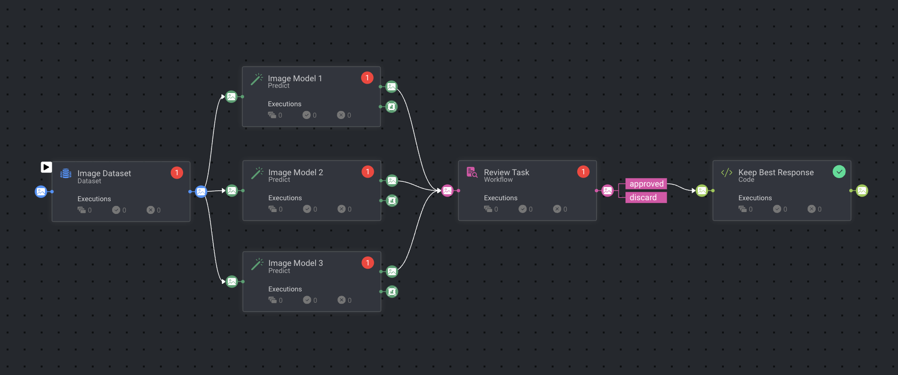

# *Image Captioning Pipeline* Template

### Introduction:

The Image Captioning Pipeline Template automates the process of generating and evaluating captions for images. This workflow leverages advanced image captioning models to create descriptive text for your images. It then facilitates the selection of the best caption from the generated options, ensuring high-quality and relevant descriptions.

### Installation:

There are two options for installing and using the template:

Option 1:

* Open the Pipelines page and select _**Create Pipeline**_.
* Select _**Use a Template**_ from the dropdown list.

Option 2:

* In the search bar, type `Image Captioning Pipeline`, select the template and click _**Install**_.
* Once the template is installed, click on _**Use Template**_ at the top or _**Create Pipeline**_ at the bottom.