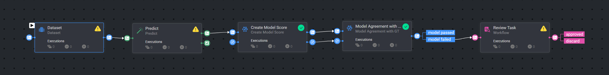

# *Compare with Model Pipeline* Template

### Introduction:

The Compare with Model Pipeline automates the process of evaluating annotation agreement between GT annotations and AI model predicted annotations. 
The workflow includes: model prediction node, consensus node for comparing GT and model annotations, and a labeling task for reviewing the results.

### Installation:

There are two options for installing and using the template:

Option 1:

* Open the Pipelines page and select _**Create Pipeline**_.
* Select _**Use a Template**_ from the dropdown list.

Option 2:

* In the search bar, type `Compare with Model Pipeline Template`, select the template and click _**Install**_.
* Once the template is installed, click on _**Use Template**_ at the top or _**Create Pipeline**_ at the bottom.
