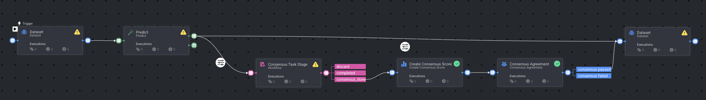

# Consensus Pipeline After Model Pre-Annotation Task Template

### Introduction

The Consensus Pipeline After Model Pre-Annotation Task Template automates the evaluation of annotation agreement following a model pre-annotation task. In this pipeline, items are first processed through a model pre-annotation task. After labeling, items enter consensus stages where annotators provide their input to calculate agreement scores based on configurable thresholds. This template supports all media types and integrates seamlessly with Dataloop's labeling workflow and task management systems.

### Installation

There are two options for installing and using the Consensus Pipeline After Model Pre-Annotation Task Template:

**Option 1:**

* Open the Pipelines page on the Dataloop platform and select _**Create Pipeline**_.
* Choose _**Use a Template**_ from the dropdown list and select **Consensus Pipeline After Model Pre-Annotation Task**.

**Option 2:**

* In the search bar, type "Consensus Pipeline After Model Pre-Annotation Task Template".
* Select the template, click _**Install**_, and then click on _**Use Template**_ at the top or _**Create Pipeline**_ at the bottom.

### Usage

After installation, you can customize the pipeline by configuring consensus thresholds and task parameters to suit your project needs. For more detailed documentation on consensus tasks, workflow configuration, and best practices, please refer to the [Consensus Documentation](https://docs.dataloop.ai/docs/consensus).