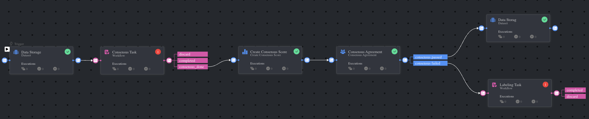

# *Consensus Pipeline* Template

### Introduction:

The Consensus Pipeline automates the process of evaluating annotation agreement between multiple annotators. The workflow includes initial annotation tasks, consensus score calculation, and automatic routing based on agreement thresholds. Items that pass consensus move forward in the pipeline, while those that fail consensus are routed to review.

### Installation:

There are two options for installing and using the template:

Option 1:

* Open the Pipelines page and select _**Create Pipeline**_.
* Select _**Use a Template**_ from the dropdown list.

Option 2:

* In the search bar, type `Consensus Pipeline Template`, select the template and click _**Install**_.
* Once the template is installed, click on _**Use Template**_ at the top or _**Create Pipeline**_ at the bottom.

### Usage:

For the complete documentation about consensus tasks and best practices, please refer to the [Consensus Documentation](https://docs.dataloop.ai/docs/consensus).