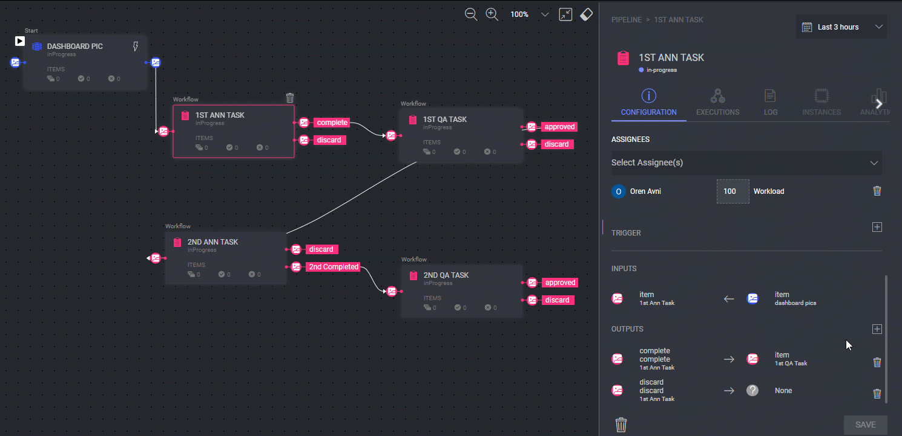
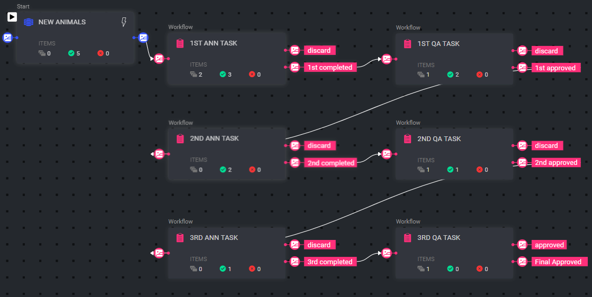

# Microtasks Pipeline Template

Breaking a complex labeling job down to multiple microtasks allows annotators to focus on specific labels, complete annotation tasks quickly, and send the image to the next microtask in line.

For example, a dataset of images from dashboard cameras can be assigned to a number of annotators: the first annotates cars, the second annotates traffic signs, the third annotates pedestrians, the fourth annotates buildings, and so on.

Each annotator and QA tester needs to focus only on a specific aspect of the task, thus increasing efficiency and accuracy.

Remember to take advantage of Dataloop’s powerful [pipeline nodes](https://dataloop.ai/docs/pipeline-nodes) to modify this template to best fit your needs.

## Installation

The installation of the Microtasks Pipeline Pipeline typically involves several key steps to ensure that the system is correctly set up and optimized for processing and analyzing multi-modal data.

### Step 1: Setting Up the Pipeline

[Create a pipeline](https://dataloop.ai/docs/creating-pipelines) using the Microtasks template.

Next, follow these steps to set each of the pipeline nodes and click **Save** after setting each node.

### Step 2: Setting the Dataset Node

1. Click on the Dataset node. In the pipeline information panel on the right, in the **Configuration** tab, select the dataset of the items you wish to annotate or create a new dataset. 
2. Set the trigger to determine when data will flow to the next node in the pipeline. For example, setting the trigger to Type: Event, Action: Created will result in items flowing to the first Task node whenever they are uploaded to the dataset.

### Step 3: Setting the Task Node

1. Click on the Task node and set the task’s recipe, dataset, owner, and assignee. 

- According to the flow in this template, items that are marked “discard” will not flow further, and items marked as “completed” in their respective annotation tasks or “approved” in their respective QA tasks will flow to the next node.

- **Note**: You can add output points or change the names of existing output points to fit your needs. These changes will be reflected in the status the annotator can assign the item. 
For example, the default output point of an annotation task node is “completed.” If you wish to change it, click the **Delete** icon next to that output.

2. Click the + icon to add a new output and give it the name you wish. 
3. Click OK and Save to add the output. Now, the annotator will be able to assign the item the status “1st Completed” when annotating the item. Adding statuses and output points to items allows infinite possibilities of data flow and filtering.

### Step 4: Start the Pipeline

Finally, when all nodes have been set according to your preferences, click the **Start Pipeline**.

## What Does this Pipeline Do When It Is Running?

Now that the pipeline is running, the annotation tasks and QA tasks defined in the pipeline will be created, and the data items will move from one Task node to the next as they are marked completed/approved in each node.

For example, in the screenshot below, you can see that 5 items were uploaded to the dataset and immediately flowed into the first annotation task. 3 items were annotated and marked completed and so flowed into the first QA task. Two of these items were approved in the first QA task and flowed to the next annotation task, and so on.

## Contributions, Bugs and Issues - How to Contribute

We welcome anyone to help us improve this app.  
[Here's](..%2F..%2FCONTRIBUTING.md) a detailed instructions to help you open a bug or ask for a feature request.