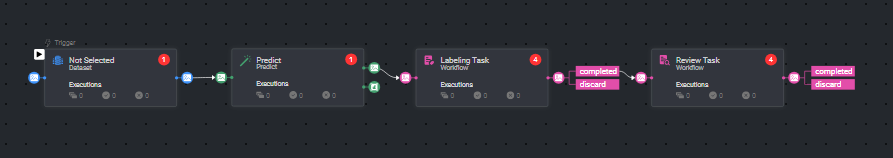

# *Model Pre-Annotation Pipeline*

### Introduction:

This pipeline streamlines the annotation process by using pre-trained models to generate pre-annotations. 
The model predicts initial annotations for the dataset, which are then sent to specific tasks for validation. 
This approach reduces manual effort and improves efficiency, ensuring faster and more accurate annotations for machine learning projects.

### Installation:

There are two options for installing and using the template:

Option 1:

* Open the pipelines page and select Create Pipeline.
* Select Use a Template from the dropdown list.

Option 2:

* In the search bar, type `Model Pre-annotation Pipeline`, select the template and click install.
* Once the template is installed, click on *Create Pipeline*.

## Contributions, Bugs and Issues - How to Contribute

We welcome anyone to help us improve this app.  
[Here's](../../CONTRIBUTING.md) a detailed instructions to help you open a bug or ask for a feature request.