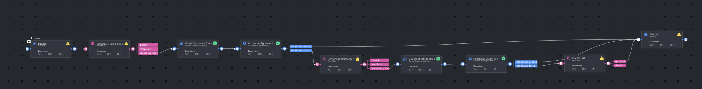

# Multi Consensus with Agreement Pipeline Template

### Introduction

The Multi Consensus with Agreement Pipeline Template automates the evaluation of annotation agreement across multiple stages. It is designed to route items based on consensus results, ensuring that items meeting the agreement thresholds proceed through the pipeline, while those failing consensus are routed for further review. This template supports all media types and integrates seamlessly with Dataloop's labeling workflow and task management systems.

In this pipeline:
- The items pass through multiple consensus tasks where annotators provide their input.
- Custom Consensus Agreement nodes calculate agreement scores using the scoring-and-metrics service based on configurable thresholds (e.g., 0.75 and 0.5 in different stages).
- Items that pass consensus are advanced, while items that fail are sent to review tasks to ensure quality control.

### Installation

There are two options for installing and using the Multi Consensus with Agreement template:

**Option 1:**

* Open the Pipelines page on the Dataloop platform and select _**Create Pipeline**_.
* Choose _**Use a Template**_ from the dropdown list and select **Multi Consensus with Agreement**.

**Option 2:**

* In the search bar, type "Multi Consensus with Agreement Pipeline Template".
* Select the template, click _**Install**_, and then click on _**Use Template**_ at the top or _**Create Pipeline**_ at the bottom.

### Usage

After installation, you can customize the pipeline by configuring consensus thresholds and task parameters to suit your project needs. For more detailed documentation on consensus tasks, workflow configuration, and best practices, please refer to the [Consensus Documentation](https://docs.dataloop.ai/docs/consensus).