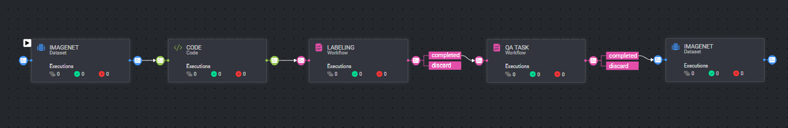

# *Preprocess Annotation Workflow*

### Introduction:

This pipeline can be used for comprehensive data processing workflow. The initial dataset is processed through a CODE
stage, which can involves data preprocessing. Following this, the data moves to the labeling task, where it
undergoes annotation. Post-labeling, the data is subjected to a QA TASK workflow, ensuring the labeled data adheres to
quality standards. This stage includes conditions for either completing the task or discarding data that doesn't meet
the criteria.

This pipeline creates clean and annotated dataset for AI projects.

** Make sure to insert your customized processing code to the CODE node.

### Installation:

There are two options for installing and using the template:

1. Pipelines:

* Open the pipelines page and select Create Pipeline.
* Select Use a Template from the dropdown list.

1. Pipelines:

* In the search bar, type `Preprocess Annotation Workflow`, select the template and click install.
* Once the template is installed, click on *Create Pipeline*.

[//]: # (### Usage:)

[//]: # ()

[//]: # (For the complete documentation of the Active learning pipeline, please refer to)

[//]: # (the [Active Learning Pipeline Documentation]&#40;https://dataloop.ai/docs/active-learning-pipeline&#41;)

## Contributions, Bugs and Issues - How to Contribute

We welcome anyone to help us improve this app.  
[Here's](CONTRIBUTING.md) a detailed instructions to help you open a bug or ask for a feature request.