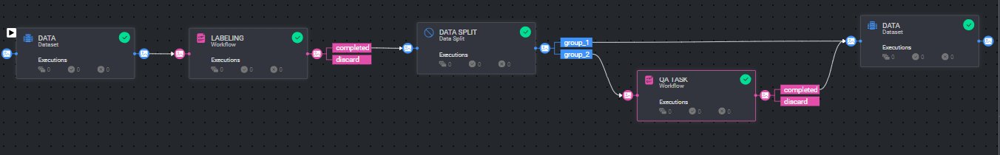

# *QA Sampling Workflow*

### Introduction:

This app implements a multi-stage data processing pipeline. It begins with a dataset, moves through a labeling 
workflow, then splits the data, directing a portion to a quality assurance task while the remainder proceeds to the 
final output stage.

This pipeline generates high-quality datasets for AI projects by using data labeling, automated splitting, 
and QA checks. It facilitate the process of creating clean, well-annotated data ready for AI applications.

### Installation:

There are two options for installing and using the template:

1. Pipelines:

* Open the pipelines page and select Create Pipeline.
* Select Use a Template from the dropdown list.

1. Pipelines:

* In the search bar, type `QA Sampling Workflow`, select the template and click install.
* Once the template is installed, click on *Create Pipeline*.

[//]: # (### Usage:)

[//]: # ()

[//]: # (For the complete documentation of the Active learning pipeline, please refer to)

[//]: # (the [Active Learning Pipeline Documentation]&#40;https://dataloop.ai/docs/active-learning-pipeline&#41;)

## Contributions, Bugs and Issues - How to Contribute

We welcome anyone to help us improve this app.  
[Here's](CONTRIBUTING.md) a detailed instructions to help you open a bug or ask for a feature request.