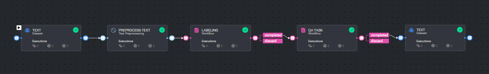

# *Text Annotation Workflow*

### Introduction:

This pipeline is designed for a comprehensive text data processing workflow. It begins with a TEXT dataset, which is processed through the PREPROCESS-TEXT node for essential text preprocessing tasks. Following this, the preprocessed data moves to the LABELING task for annotation. After labeling, the data undergoes a QA TASK workflow to ensure the labeled data meets quality standards. This stage includes conditions for either completing the task or discarding data that doesn't meet the criteria.

This pipeline creates clean and annotated text datasets for various AI projects.

### Installation:

There are two options for installing and using the template:

1. Pipelines:

* Open the pipelines page and select Create Pipeline.
* Select Use a Template from the dropdown list.

1. Pipelines:

* In the search bar, type `Text Annotation Workflow`, select the template and click install.
* Once the template is installed, click on *Create Pipeline*.

[//]: # (### Usage:)

[//]: # ()

[//]: # (For the complete documentation of the Active learning pipeline, please refer to)

[//]: # (the [Active Learning Pipeline Documentation]&#40;https://dataloop.ai/docs/active-learning-pipeline&#41;)

## Contributions, Bugs and Issues - How to Contribute

We welcome anyone to help us improve this app.  
[Here's](../../CONTRIBUTING.md) a detailed instructions to help you open a bug or ask for a feature request.