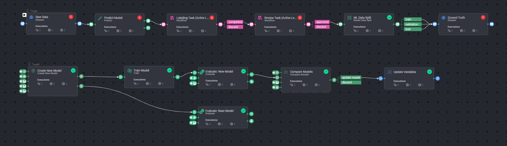
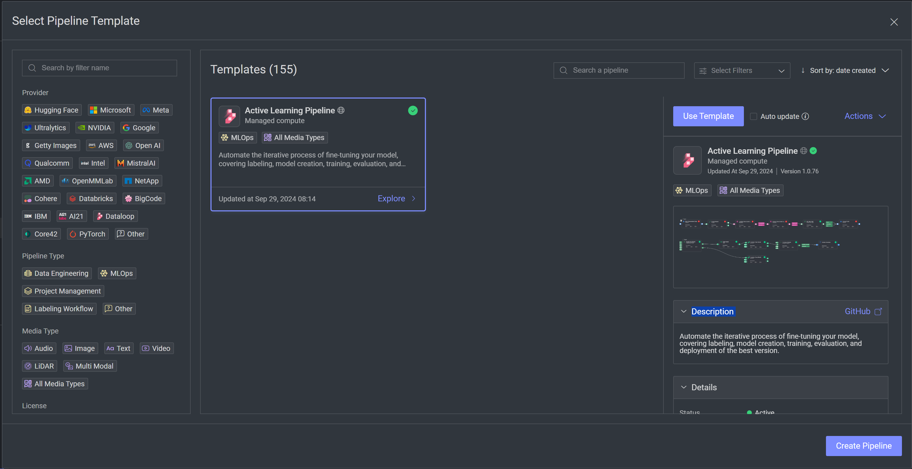

# *Active Learning* Template



### Introduction:

Active Learning automates the iterative process of fine-tuning your model, covering labeling, model creation, training, evaluation, and
deployment of the best version.

### Installation:

To use the template, follow these steps:

* Open the Pipelines page and select _**Create Pipeline**_.
* Select _**Use a Template**_ from the dropdown list.


* In the search bar, type `Active Learning Template`, select the template and click _**Install**_.
* Once the template is installed, click on _**Use Template**_ at the top or _**Create Pipeline**_ at the bottom.
* Under the pipeline variables icon [*X*], enter entity IDs for each variable listed.



### Usage:
It's recommended to use pipeline variables and enter the necessary IDs for each variable for optimal use.

#### Pipeline Structure
The template consists of two main pipelines:

1. **Top Pipeline: Annotation Workflow**
   - Manages the annotation process
   - Creates and assigns annotation tasks
   - Handles the review and approval of annotations

2. **Bottom Pipeline: Model Train and Compare Workflow**
   - Handles the complete continuous learning cycle
   - Includes data preparation, model training, evaluation, and deployment
   - Automatically triggers the bottom pipeline for annotation tasks


#### Pipeline Variables
The pipeline uses variables that need to be configured:
- `Raw Dataset` - the unannotated dataset with images
- `Best Model` - the model ID for the current best model
- `Ground Truth Dataset` - dataset with labeled ground truth images
- `Train Subset Filter` - DQL filter for training images
- `Validation Subset Filter` - DQL filter for validation images
- `Test Subset Filter` - DQL filter for test images
- `Model Configuration` - JSON for updating the configuration for the new model to be created. Can be left blank if you want to keep the base model's configs.
- `Comparison Configuration` - JSON for the comparison config, using scorese from the evaluation results (currently only precision-recall is supported).


#### Manual Pipeline Execution
By default, the pipeline start node is on the top pipeline and the bottom pipeline will execute according to the node trigger.

You can manually run specific parts of the pipeline by moving the start node and using the Dataloop SDK:

```python
pipeline = dl.pipelines.get(pipeline_id='your_pipeline_id')
pipeline.execute()
```

#### Pipeline Structure
The template consists of two main pipelines:

1. **Top Pipeline: Annotation Workflow**
   - Manages the annotation process
   - Creates and assigns annotation tasks
   - Handles the review and approval of annotations

2. **Bottom Pipeline: Model Train and Compare Workflow**
   - Handles the complete continuous learning cycle
   - Includes data preparation, model training, evaluation, and deployment
   - Automatically triggers the bottom pipeline for annotation tasks


#### Pipeline Variables
It's recommended to use pipeline variables and enter the necessary IDs for each variable for optimal use.

The pipeline uses variables that need to be configured:
- `Raw Dataset` - the unannotated dataset with images
- `Best Model` - the model ID for the current best model
- `Ground Truth Dataset` - dataset with labeled ground truth images
- `Train Subset Filter` - DQL filter for training images
- `Validation Subset Filter` - DQL filter for validation images
- `Test Subset Filter` - DQL filter for test images
- `Model Configuration` - JSON for updating the configuration for the new model to be created. Can be left blank if you want to keep the base model's configs.
- `Comparison Configuration` - JSON for the comparison config, using scorese from the evaluation results (currently only precision-recall is supported).


#### Manual Pipeline Execution
By default, the pipeline start node is on the top pipeline and the bottom pipeline will execute according to the node trigger.

You can manually run specific parts of the pipeline by moving the start node and using the Dataloop SDK:

```python
pipeline = dl.pipelines.get(pipeline_id='your_pipeline_id')
pipeline.execute()
```

For the complete documentation of the Active Learning pipeline, please refer to
the [Active Learning Pipeline Documentation](https://docs.dataloop.ai/docs/active-learning-pipeline)
