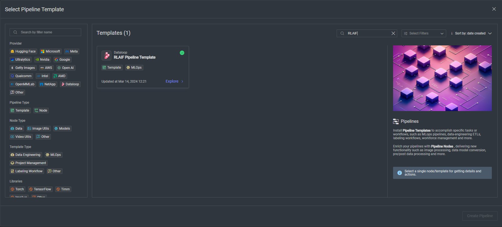

# *RLAIF* Template

### Introduction:

This template streamlines the process of Reinforcement Learning from AI Feedback (RLAIF) by leveraging multiple Language 
Model (LLM) models. The outputs from these models are routed through a consensus node, where approved results proceed 
to the next stage of the AI-driven process, while rejected outcomes are directed to a labeling task for further 
refinement.

### Installation:

In order to use the template, you need to follow these steps:

* Open the pipelines page and select Create Pipeline.
* Select Use a Template from the dropdown list.

* In the search bar, type `RLAIF`, select the template and click install.
* Once the template is installed, click on *Create Pipeline*.

[//]: # (### Usage:)

[//]: # ()
[//]: # (For the complete documentation of the Active learning pipeline, please refer to)

[//]: # (the [Active Learning Pipeline Documentation]&#40;https://dataloop.ai/docs/active-learning-pipeline&#41;)

## Contributions, Bugs and Issues - How to Contribute

We welcome anyone to help us improve this app.  
[CONTRIBUTING.md](..%2F..%2FCONTRIBUTING.md) a detailed instructions to help you open a bug or ask for a feature request.