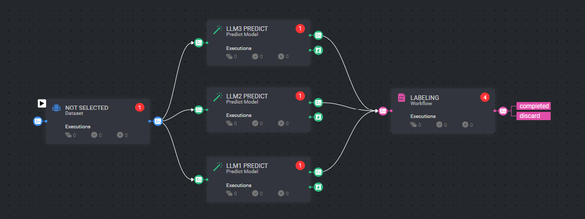
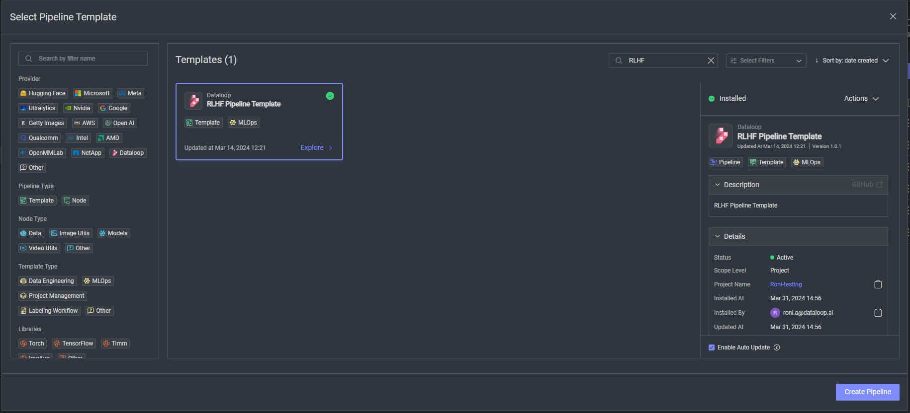

# *RLHF* Template

### Introduction:

This template streamlines the process of Reinforcement Learning from Human Feedback (RLAIF). The pipeline uses multiple LLMs, 
directs their outputs to a labeling node, allowing for the integration of human feedback into the workflow.

### Installation:

In order to use the template, you need to follow these steps:

* Open the pipelines page and select Create Pipeline.
* Select Use a Template from the dropdown list.

* In the search bar, type `RLHF`, select the template and click install.
* Once the template is installed, click on *Create Pipeline*.

[//]: # (### Usage:)

[//]: # ()
[//]: # (For the complete documentation of the Active learning pipeline, please refer to)

[//]: # (the [Active Learning Pipeline Documentation]&#40;https://dataloop.ai/docs/active-learning-pipeline&#41;)

## Contributions, Bugs and Issues - How to Contribute

We welcome anyone to help us improve this app.  
[Here's](CONTRIBUTING.md) a detailed instructions to help you open a bug or ask for a feature request.