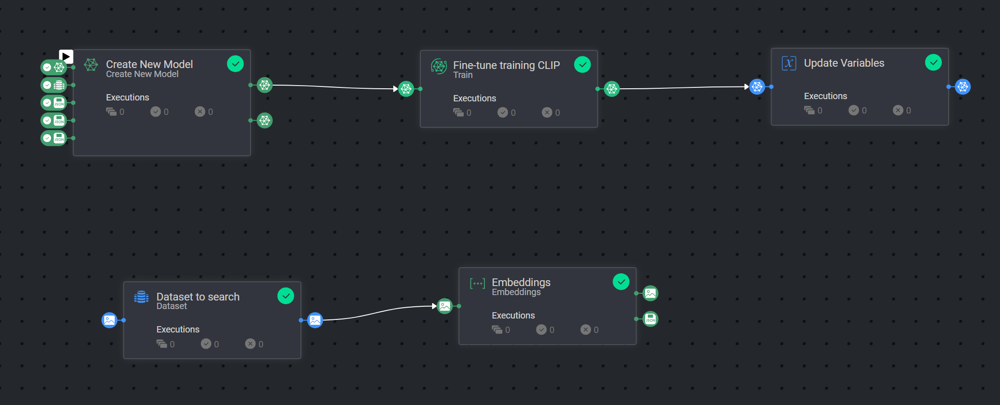
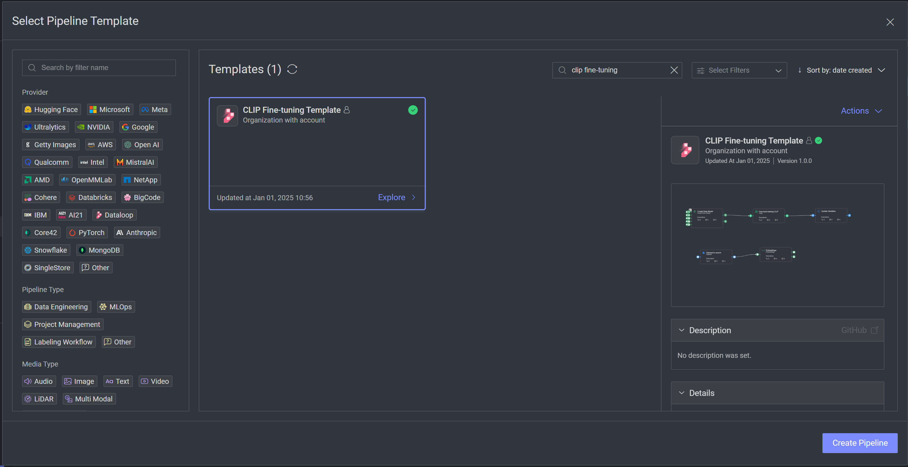

# *CLIP Fine-tuning* Template



### Introduction:

CLIP fine-tuning leverages the advantages of OpenAI's CLIP for your VLM needs, and fine-tunes the model on your custom
dataset. This template sets up the fine-tuning pipeline with CLIP, and also provides the option to embed a dataset
with the fine-tuned model.

### Dataset Preparation

To train CLIP, you need a dataset with images and descriptions. For a detailed tutorial on how to set up a dataset and fine-tuning, see the Fine-tuning CLIP notebook [found here](https://developers.dataloop.ai/notebooks/notebooks).

In the case of training CLIP in conjunction with captioning pipelines, prompt item datasets are also supported. If using prompt items for captioning, two datasets are required:

- The first contains all images for the model as regular image items.
- The second contains prompt items with the image as the user prompt, and the text annotation.

See the [image captioning pipeline](https://github.com/dataloop-ai-apps/pipeline-templates/blob/main/image_preprocessing/image_captioning_pipeline/README.md) for an example of how the prompt items should be formatted.

### Installation:

To use the template, follow these steps:

* Open the Pipelines page and select _**Create Pipeline**_.
* Select _**Use a Template**_ from the dropdown list.


* In the search bar, type `CLIP Fine-tuning Template`, select the template and click _**Install**_.
* Once the template is installed, click on _**Use Template**_ at the top or _**Create Pipeline**_ at the bottom.
* Under the pipeline variables icon [*X*], enter entity IDs for each variable listed.
* Press "Start Pipeline" to activate the pipeline.

To allow for optimal use of the pipeline, it's recommended to use variables rather than fixed entities or input values.



It's recommended to use pipeline variables and enter the necessary IDs for each variable for optimal use.

### Pipeline Structure
The template consists of two main components:

1. **Training Pipeline**
   - Fine-tunes the CLIP model using your dataset with captions
   - Uses the base CLIP model as a starting point
   - Updates the "Newest CLIP model" variable for the embedding pipeline

2. **Embedding Pipeline**
   - Uses the newly trained CLIP model to generate embeddings for images and text
   - Saves the embeddings for future use or semantic search

### Pipeline Variables
The following variables should be configured:
- **Dataset with captions**: Dataset containing images with captions as item descriptions.This can also be a prompt item dataset, with image as the prompt and caption as the assistant response (free-text annotation).
- **Base CLIP model**: The base CLIP model to clone and train from. This can be a pre-trained foundational model or a previously fine-tuned model.
- **Newest CLIP model**: The model ID for the newly trained CLIP model. On the first run, enter the base model ID as a placeholder. This variable is updated automatically after training.
- **Model config**: (JSON) Configuration for the new fine-tuned model. Can be an empty dict to keep original configs, or will update existing model configs with fields from this dict. Example:
  ```json
  {
    "model_name": "ViT-B/32",
    "embeddings_size": 512,
    "batch_size": 128,
    "num_epochs": 20,
    "early_stopping": true,
    "early_stopping_epochs": 5,
    "learning_rate": 5e-7,
    "betas": [0.9, 0.98],
    "weight_decay": 0.01
  }
  ```

### Manual Pipeline Execution

You can run the pipeline using the Dataloop SDK:

```python
import dtlpy as dl
project = dl.projects.get('<your_project_name>')
pipeline = project.pipelines.get(pipeline_name='CLIP Fine-tuning Template')
pipeline.execute()
```

## Attribution

This application uses OpenAI's CLIP, which is licensed under the MIT License. CLIP is a powerful open-source model for
image and text understanding developed by OpenAI.

### Acknowledgments

The CLIP model and code are the intellectual property of OpenAI.

Thank you to the contributors of the CLIP project for their work in advancing multimodal AI research.
