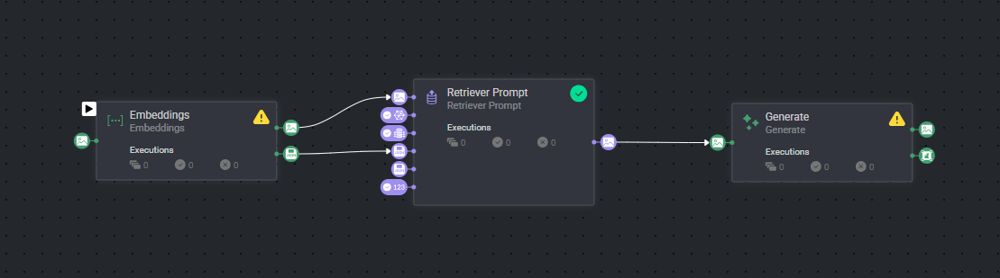
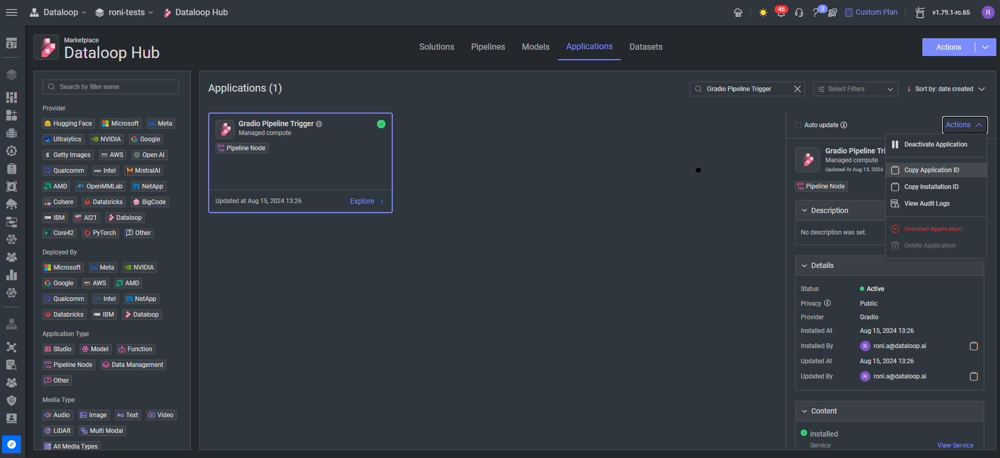
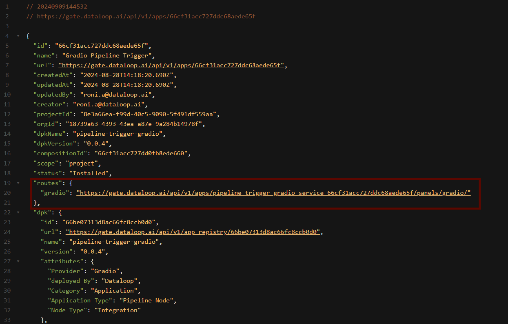
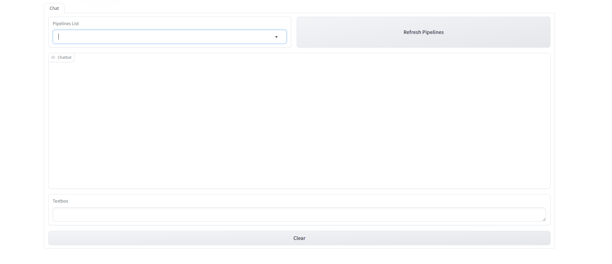
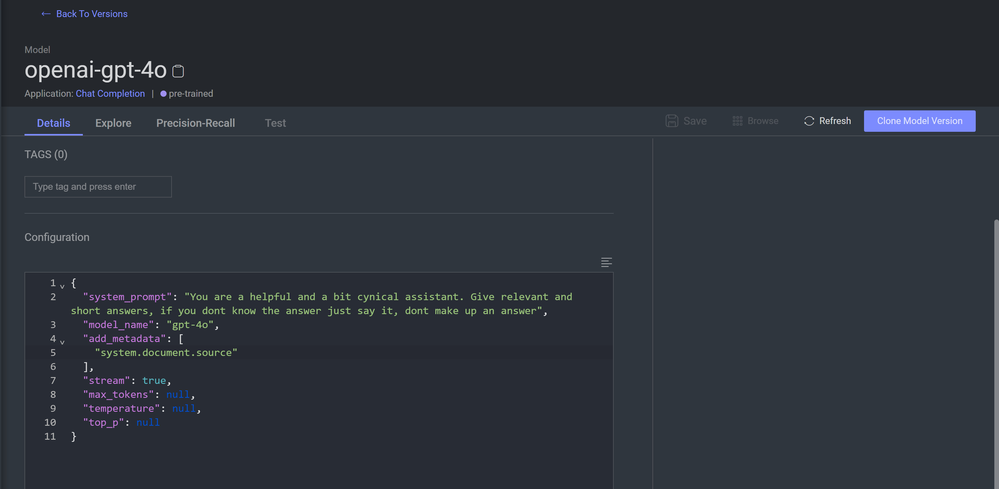

# *RAG Pipeline* Template

### Introduction:

This repository provides a Retrieval-Augmented Generation (RAG) pipeline template designed to handle user queries,
retrieve relevant information, and generate detailed responses using OpenAI models
in [Dataloop Platform](https://dataloop.ai/).
The pipeline integrates multiple components, including a Gradio app, an OpenAI text embedder, a retriever, and a ChatGPT
model.

## Components

### 1. Gradio App

The Gradio interface serves as the user-facing part of the pipeline. It allows users to communicate by inputting
free-text questions, to which the model will provide detailed responses. The app is designed for ease of use and
interaction.

#### To reach the gradio:

1. Go to marketplace, application tab, search for `Gradio Pipeline Trigger` and install it.
2. On the left panel, click on `Copy Installation ID`:

3. Click on this link: [EndPoint](https://gate.dataloop.ai/api/v1/apps/) and insert the copied `Installation ID`.
4. Click on the `gradio` link:

and the gradio app will open:

### 2. OpenAI Text Embeddings

OpenAI's `text-embedding-3` model is used to convert user questions into embeddings. These embeddings serve as the
foundation for retrieving relevant information from a dataset.

- **How it works**:
    - The user input is processed and embedded.
    - Embeddings are passed to the retriever for further analysis.

### 3. Retriever

The retriever is responsible for finding the most relevant items from a predefined dataset. It takes the following
inputs:

- **Embeddings**: Generated from the OpenAI model based on the user question.
- **Dataset ID**: The dataset from which the retriever will look for information.
- **Feature Set ID**: The specific feature set within the dataset.
- **Query Filter**: Optional filtering DQL to refine the search results.
- **K Nearest Items**: Defines how many of the closest items to return based on the similarity of embeddings.

#### A Preprocess stage is to create a feature set to the dataset using OpenAI's `text-embedding-3` embedder.

### 4. ChatGPT Model

Once the retriever finds the most relevant items, a ChatGPT model generates a comprehensive response. The model:

- Summarizes the retrieved information.
- Answers the user's question based on the system's predefined prompt and the retrieved results.

#### You can modify the model's system prompt in the Model Management tab under the Configuration section on the model's page:

### Installation:

In order to use the template, you need to follow these steps:

* Open the pipelines page and select Create Pipeline.
* Select Use a Template from the dropdown list.

* In the search bar, type `RAG`, select the template and click install.
* Once the template is installed, click on *Create Pipeline*.

## Contributions, Bugs and Issues - How to Contribute

We welcome anyone to help us improve this app.  
[Here's](CONTRIBUTING.md) a detailed instructions to help you open a bug or ask for a feature request.