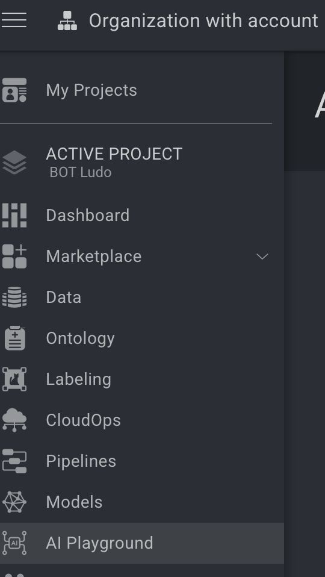
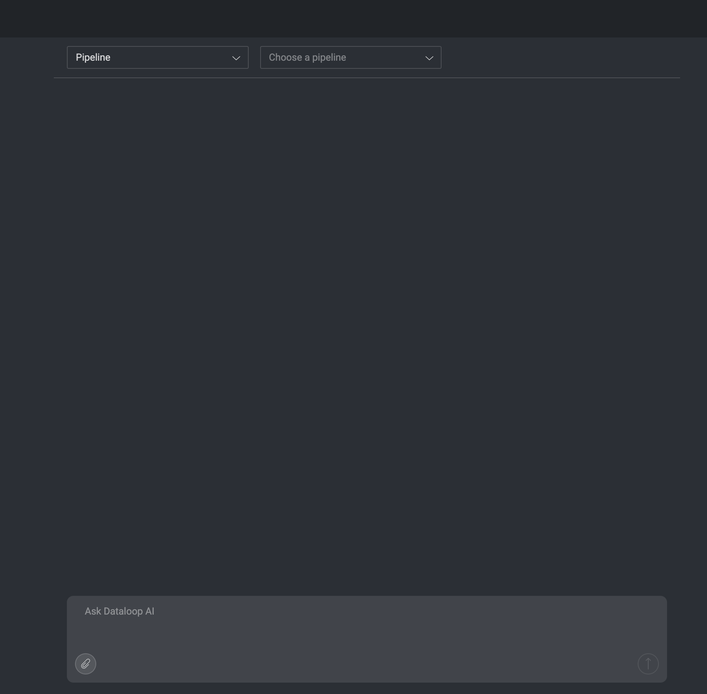
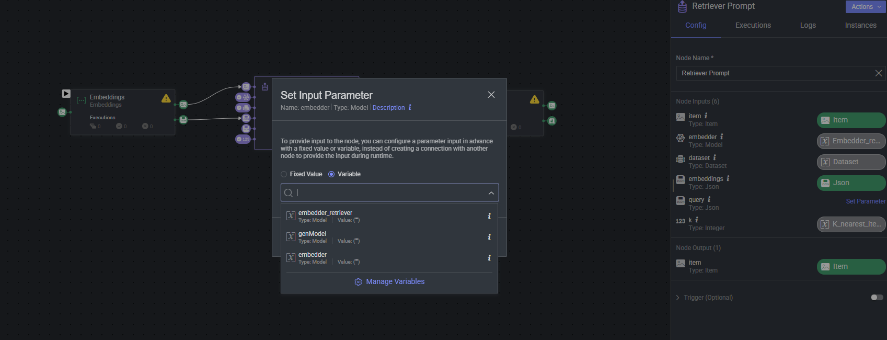
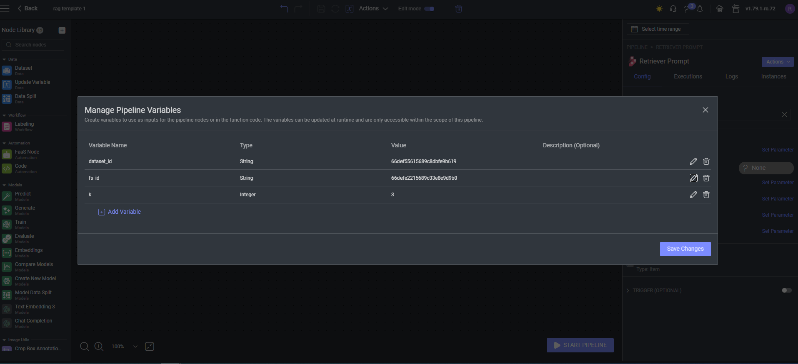
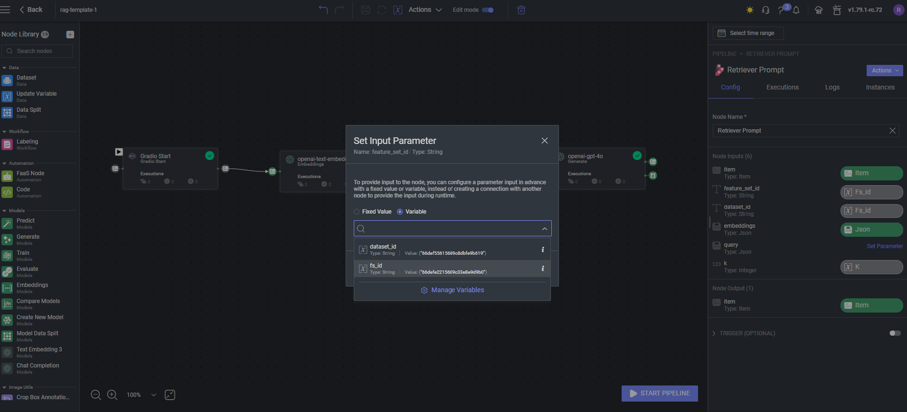

# *RAG Pipeline* Template


### Introduction:

This app provides a customizable **Retrieval-Augmented Generation (RAG)** pipeline template, designed to streamline 
query processing and response generation.

## Key Features:
- **Embedder**: Embed user queries.
- **Retriever**: Supports retrieving relevant documents.
- **Generative Model**: Generates detailed, context-based responses.

You can install any embedding and generative models from the Dataloop Marketplace and configure 
them within the relevant nodes of the pipeline [Dataloop Website](https://dataloop.ai/).

### Note:
Source datasets must be pre-embedded during the preprocessing stage for optimal performance.


## Components

### 1. AI Playground

Use Dataloop's **AI Playground** to communicate with the pipeline:



Choose the pipeline you want to use from the dropdown menu, and start chatting with the model inside the pipeline:



### 2. Embedder

Choose an Embedder form Marketplace and assign the model in the embeddings node.

- **How it works**:
    - The user input is processed and embedded.
    - Embeddings are passed to the retriever for further analysis.

### 3. Retriever

The retriever is responsible for finding the most relevant items from a predefined dataset. It takes the following
inputs:

- **Prompt**: The prompt item of the conversion.
- **Embeddings**: Generated from the model based on the user question.
- **Dataset ID**: The dataset from which the retriever will look for information.
- **Embedder Retriver**: The embedder used to embed the source dataset.
- **Query Filter**: Optional filtering DQL to refine the search results.
- **K Nearest Items**: Defines how many of the closest items to return based on the similarity of embeddings.

#### To edit these parameters on the pipeline node:

1. Click on one of the input parameters of the `retriever` node to add the variables to the pipeline:



2. Insert the values of the `dataset_id`, `embedder_retriver`, `k nearest items`, `genModel`, `embedder` and save changes.



Further parameters:
- **GenModel**: The generative model to use to generate the response.
- **Embedder**: The embedder to use to embed the user query.

to get your `feature_set_id` use the SDK:

```python
import dtlpy as dl

project = dl.projects.get(project_name= < your - project - name >)
fs_id = project.feature_sets.get(feature_set_name= < your - fs - name >).id
```

3. Then, assign each pipeline variable for each input parameter on the node:



#### A Preprocess stage is to create a feature set to the dataset using the embedder you chose.

### 4. Generative Model

Choose a Generative model form Marketplace and assign the model in the generate node.
Once the retriever finds the most relevant items, a generative model generates a comprehensive response. The model:

- Summarizes the retrieved information.
- Answers the user's question based on the system's predefined prompt and the retrieved results.

#### You can modify the model's system prompt in the Model Management tab under the Configuration section on the model's page:


An optional prompt:

```plaintext
"You are an AI assistant designed to answer questions using a provided set of documents. Your primary goal is to deliver precise and accurate responses, citing the relevant document sources for each answer. If the documents do not contain the necessary information, inform the user accordingly. Maintain a friendly and professional demeanor in all interactions."
```

### Installation:

In order to use the template, you need to follow these steps:

* Open the pipelines page and select Create Pipeline.
* Select Use a Template from the dropdown list.


* In the search bar, type `RAG`, select the template and click install.
* Once the template is installed, click on *Create Pipeline*.

