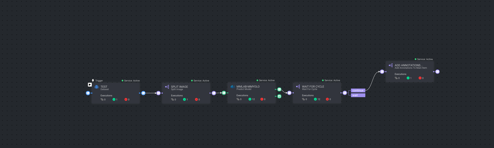

# Tiling Pipeline Template

Template for **Image Tiling Split**, to simplify the Smart Tiling pipeline creation.

  

## Pipeline Nodes

1.  **Split Image:**

    - **Description:** Split image to tiles based on tile size and minimal overlap
    - **Configuration:**
    - `tile_size`: The size of each tile in pixels.
    - `min_overlapping`: The minimum overlap between adjacent tiles in pixels.

2.  **Wait For Cycle:**

    - **Description:** Wait until all previous executions are done

3.  **Add Annotations To Parent Item:**

    - **Description:** Add all bounding box annotations to the main item
