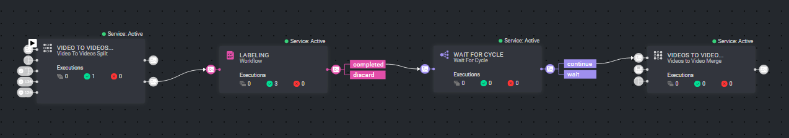

# Video Trim and Stitch Pipeline Template

### Introduction:

Automate the video annotations trimming and stitching process.

### installation:

In order to use the template, you need to follow these steps:

* Open the pipelines page and select Create Pipeline.
* Select Use a Template from the dropdown list.
* In the search bar, type `Video Trim and Stitch Pipeline`, select the template and click install.
* Once the template is installed, click on *Create Pipeline*.

### Required Services:
1. `[Video Utils] - Stitching`
2. `[Video Utils] - Trimming`
3. `Image Tiling Split`

## Contributions, Bugs and Issues - How to Contribute

We welcome anyone to help us improve this app.  
[Here's](../../CONTRIBUTING.md) a detailed instructions to help you open a bug or ask for a feature request.
